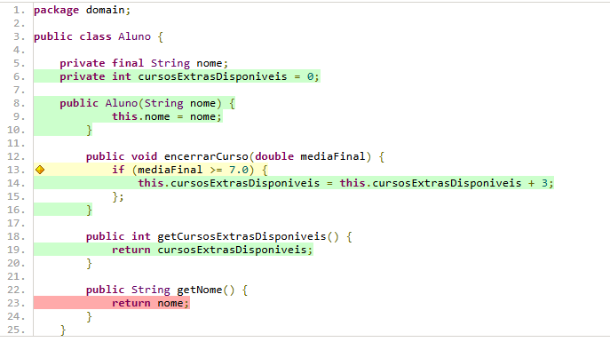
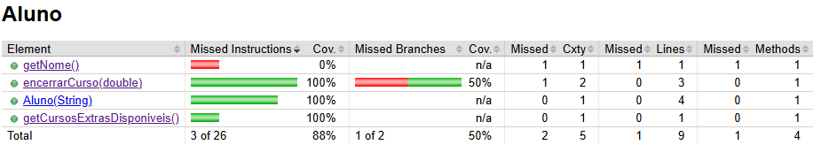
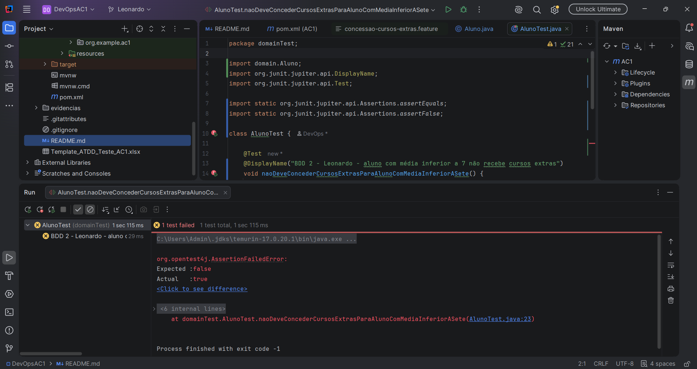
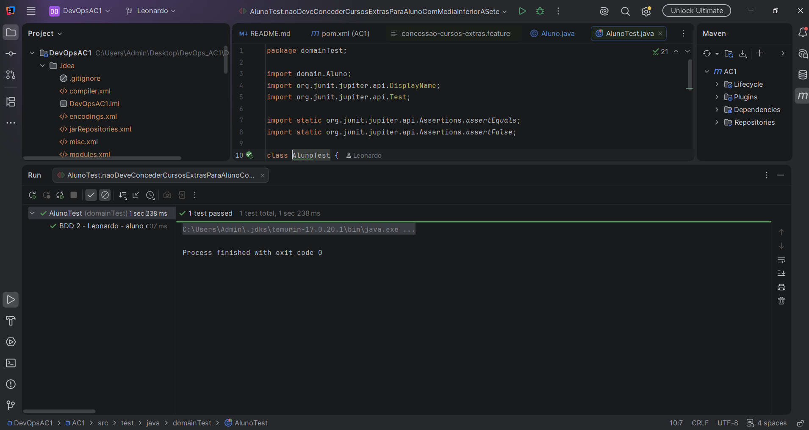
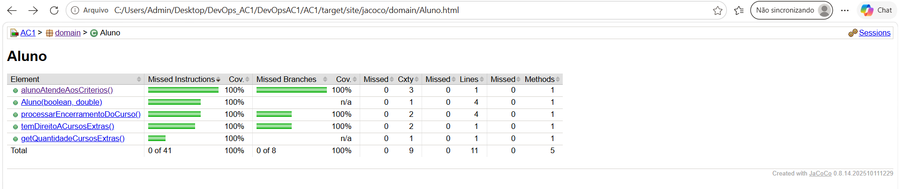
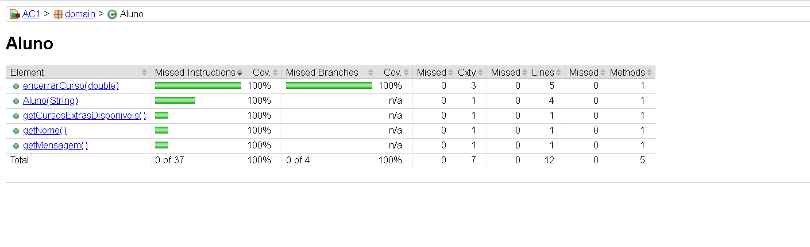
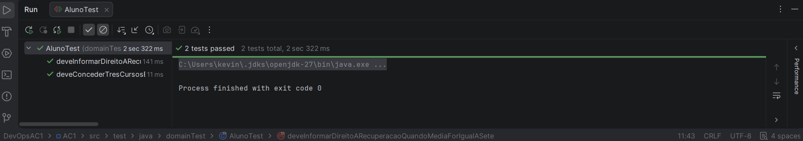

# DevOpsAC1

## Participação individual — Gabriel

### User Story escolhida

**Como** administrador de uma plataforma de ensino gamificada,
**quero** criar uma missão de "subir de nível" para o aluno,
**para** manter o engajamento através de gamificação.

### BDD 1 — Gabriel

**Cenário:** aluno com média igual ou superior a 7,0 recebe cursos extras.

* **Dado** um aluno que concluiu um curso;
* **E** sua média final foi igual ou superior a 7,0;
* **Quando** o sistema processa o encerramento do curso;
* **Então** ele deve ter direito a escolher mais três cursos.

### Implementação com TDD

A implementação foi desenvolvida seguindo o ciclo RED, GREEN e BLUE.

#### 🔴 RED

Antes de qualquer implementação, o teste foi executado e falhou conforme esperado, comprovando que ele realmente testa a regra de negócio e não um "green falso".

#### 🟢 GREEN

Com a implementação de `Aluno.encerrarCurso()` feita, o teste principal passou. Nesta etapa a cobertura de código ainda não estava em 100% — o branch referente ao cenário de média inferior a 7,0 seria coberto posteriormente pelo BDD 2 (Leonardo), como parte do trabalho dividido entre a equipe.

#### 🔵 BLUE

Após o GREEN, a classe `Aluno` foi revisada (ajustes de formatação e nomenclatura) e testes complementares foram adicionados para fechar os branches não cobertos. Com isso, a suíte de testes atingiu 100% de cobertura, sem necessidade de refatoração adicional na lógica de negócio.

### Arquivos implementados

* `AC1/src/main/java/domain/Aluno.java`
* `AC1/src/test/java/domainTest/AlunoTest.java`

### Regra implementada

* Aluno com curso concluído e média igual ou superior a 7,0 recebe três cursos extras.
* Aluno com média inferior a 7,0 não recebe cursos extras (branch complementado pelo BDD 2 — Leonardo).

## Participação individual — Leonardo

### User Story escolhida

**Como** administrador da plataforma,
**quero** conceder automaticamente o direito a mais três cursos para alunos que concluírem um curso com média superior a 7,0,
**para** incentivar a retenção e o bom desempenho acadêmico na plataforma.

### BDD 2 — Leonardo

**Cenário:** aluno com média inferior a 7,0 não recebe cursos extras.

* **Dado** um aluno que concluiu um curso;
* **E** sua média final foi inferior a 7,0;
* **Quando** o sistema processa o encerramento do curso;
* **Então** ele não deve ter direito a escolher mais três cursos.

O cenário também está versionado em:

`AC1/src/test/resources/features/concessao-cursos-extras.feature`

### Implementação com TDD

A implementação foi desenvolvida seguindo o ciclo RED, GREEN e BLUE.

#### RED

O teste foi criado antes da implementação correta da regra. A primeira versão concedia três cursos independentemente da média, fazendo o teste falhar com o resultado esperado `false` e o resultado obtido `true`.

#### GREEN

A regra foi implementada para conceder três cursos somente quando o aluno concluiu o curso e obteve média superior a 7,0. Com a correção, o teste do BDD 2 passou.

#### BLUE

O código foi refatorado com constantes para a média mínima e a quantidade de cursos extras, além da extração do critério de elegibilidade para um método próprio.

Também foram adicionados testes técnicos complementares para cobrir todos os caminhos da regra de negócio.

O relatório do JaCoCo apresentou:

* 100% das instruções;
* 100% dos branches;
* 100% das linhas;
* 100% dos métodos;
* 100% das classes.

### Arquivos implementados

* `AC1/src/main/java/domain/Aluno.java`
* `AC1/src/test/java/domainTest/AlunoTest.java`
* `AC1/src/test/resources/features/concessao-cursos-extras.feature`
* `evidencias/Leonardo/BDD2-RED.png`
* `evidencias/Leonardo/BDD2-GREEN.png`
* `evidencias/Leonardo/BDD2-BLUE-JACOCO-100.png`

### Regra implementada

* Aluno com curso concluído e média superior a 7,0 recebe três cursos extras.
* Aluno com média inferior a 7,0 não recebe cursos extras.
* Aluno que ainda não concluiu o curso não recebe cursos extras.

## Participação individual — Ariane

### BDD 3 — Ariane

**Cenário:** aluno com média final igual a 7,0 tem direito à recuperação.

* **Dado** um aluno que concluiu um curso;
* **E** sua média final foi igual a 7,0;
* **Quando** o sistema processa o encerramento do curso;
* **Então** ele deve ter direito a uma recuperação.

### Implementação com TDD

A implementação foi desenvolvida seguindo o ciclo RED, GREEN e BLUE.

🔴 RED
O teste foi criado para validar que, ao encerrar um curso com média final igual a 7,0, o aluno recebe a mensagem informando seu direito à recuperação.

Nesta etapa, a implementação retornava propositalmente uma mensagem incorreta. O teste falhou conforme esperado, apresentando:

* **Esperado:** `Aluno tem direito a uma recuperação`
* **Obtido:** `Mensagem errada`

Essa falha comprova que o teste está validando corretamente a regra de negócio.

#### 🟢 GREEN

Após corrigir a mensagem de recuperação, os dois testes passaram.

#### 🔵 BLUE

Após o GREEN, a mensagem de recuperação foi extraída para uma
constante, mantendo o comportamento da regra de negócio.

Foram adicionados testes complementares para verificar o nome
do aluno e o cenário de média inferior a 7,0.

O relatório do JaCoCo confirmou 100% de cobertura de instruções,
branches, linhas e métodos da classe Aluno.

