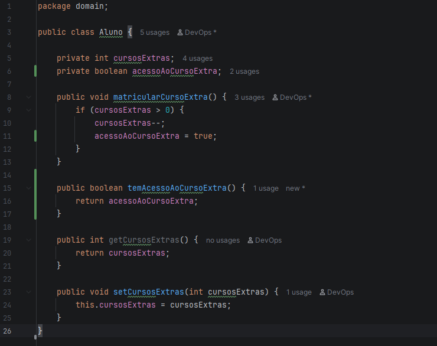
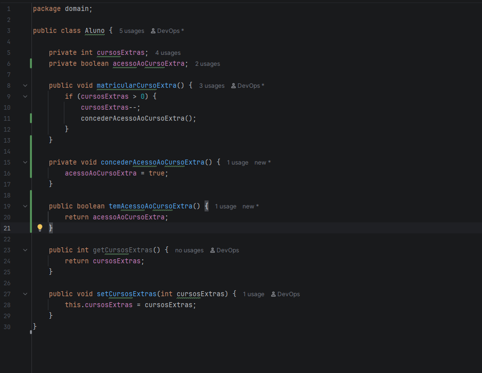

## Participação individual — Luiz

### User Story escolhida

**Como** administrador da plataforma,
**quero** conceder automaticamente o direito a mais três cursos para alunos que concluírem um curso com média superior a 7,0,
**para** incentivar a retenção e o bom desempenho acadêmico na plataforma.

### BDD 4 — Luiz

**Cenário:** aluno utiliza os três cursos extras liberados por desempenho.

* **Dado** um aluno com saldo de três novos cursos liberados por desempenho;
* **E** que já realizou a escolha do primeiro e do segundo curso adicional;
* **Quando** ele efetua a matrícula no terceiro curso;
* **Então** ele deve receber o acesso ao curso normalmente;
* **E** o sistema deve zerar o saldo de cursos extras acumulados.

### Implementação com TDD

A implementação foi desenvolvida seguindo o ciclo RED, GREEN e BLUE.

#### 🔴 RED

O teste foi criado para validar que, após a matrícula no terceiro curso adicional, o aluno deve receber acesso ao curso.

Nesta etapa, o teste foi executado antes da implementação da funcionalidade de acesso ao curso extra. O teste falhou conforme esperado, pois o método `temAcessoAoCursoExtra()` ainda não existia na classe `Aluno`.

O erro apresentado foi:


* **Esperado:** verificar se o aluno possui acesso ao curso extra;
* **Obtido:** erro de compilação, pois o método `temAcessoAoCursoExtra()` não estava implementado.

Essa falha comprova que o teste foi criado antes da implementação da regra, caracterizando a etapa RED.

#### 🟢 GREEN

Após a falha do teste, foi implementada a funcionalidade mínima necessária na classe `Aluno`.

Foi adicionada a propriedade responsável por controlar o acesso ao curso extra:

```java
private boolean acessoAoCursoExtra;
```



Também foi implementado o método `temAcessoAoCursoExtra()` e ajustado o método `matricularCursoExtra()` para conceder o acesso ao curso quando houver saldo disponível.

Após a implementação, os testes foram executados novamente e apresentaram:


Dessa forma, o teste passou conforme esperado, concluindo a etapa GREEN.

#### 🔵 BLUE

Após o GREEN, a implementação foi revisada buscando melhorar a organização do código sem alterar o comportamento validado pelos testes.

A lógica de concessão de acesso ao curso extra foi extraída para um método específico, `concederAcessoAoCursoExtra()`, mantendo a responsabilidade da matrícula separada da responsabilidade de conceder o acesso.



Após a refatoração, os testes devem continuar sendo executados para garantir que o comportamento anteriormente validado permaneça funcionando.

### Arquivos implementados

* `AC1/src/main/java/domain/Aluno.java`
* `AC1/src/test/java/domainTest/AlunoTest.java`

### Regra implementada

* Aluno com saldo de cursos extras pode realizar matrículas enquanto houver saldo disponível.
* Ao efetuar uma matrícula em um curso extra, o aluno recebe acesso ao curso.
* Após utilizar os três cursos extras liberados por desempenho, o saldo de cursos extras é zerado.
